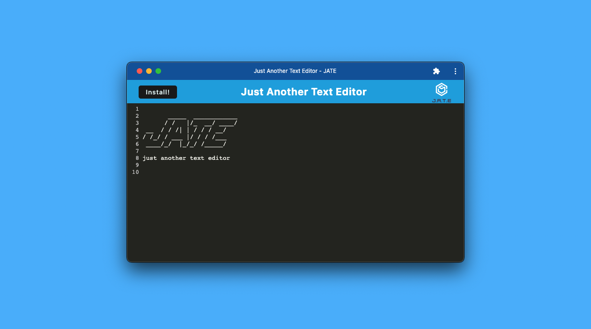
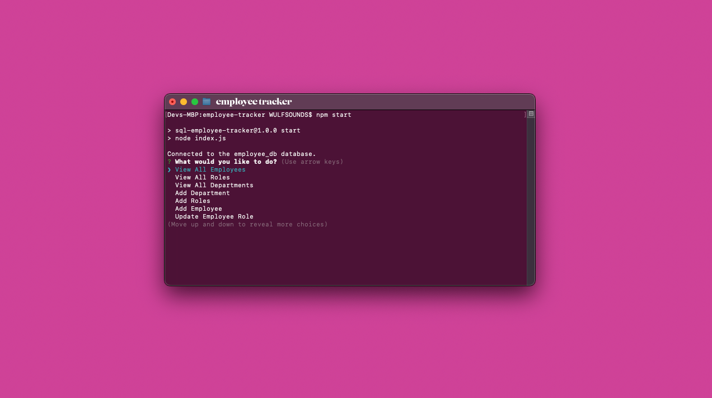

# Wulfsounds Folio

## Hello!

Thanks for checking out my portfolio! I just recently cooked this up using React and happy to share it. I have a passion to build really cool looking websites and currently a student to a full-stack web programming bootcamp. Feel free to reach out for questions! 

## Table of Contents

- [Projects](#projects)
- [Technology](#technology)
- [License](#license)
- [Contact](#contact)

## Projects

### Thyme - Group 2 Project

[Thyme Repo](https://github.com/wulfsounds/g2p-thyme)

* [Devin Wulf](https://github.com/wulfsounds)

* [Caitlin Stevenson](https://github.com/inna-arabejo)

* [Emily Vazquez](https://github.com/Emily-MVaz)

* [Neema Velasco](https://github.com/nvsco-10)

### Junkfood - Group 3 Project

[Junkfood Repo](https://github.com/wulfsounds/g3p-junkfood)

* [Devin Wulf](https://github.com/wulfsounds)

* [Inna Arabejo](https://github.com/inna-arabejo)

* [Victor Kennedy](https://github.com/Victorini1)

### Daytripper

[Daytripper Repo](https://github.com/wulfsounds/daytripper)

* Additional Assistance in JavaScript:
   - [Eugene Ahn](https://github.com/eugene125)
   - [Kelly Jefferies](https://github.com/ksjefferies)
   - Daniel Norred

### Weather

[Weather Repo](https://github.com/wulfsounds/weather-dashboard)

### Just Another Text Editor

[Just Another Text Editor Repo](https://github.com/wulfsounds/pwa-text-editor)

### Employee Tracker

[Employee Tracker](https://github.com/wulfsounds/sql-employee-tracker)

## Technology

# My Tech Stack

## Languages

## Technology

### Database

### Design

### Additional Technologies
Procreate, Insomnia